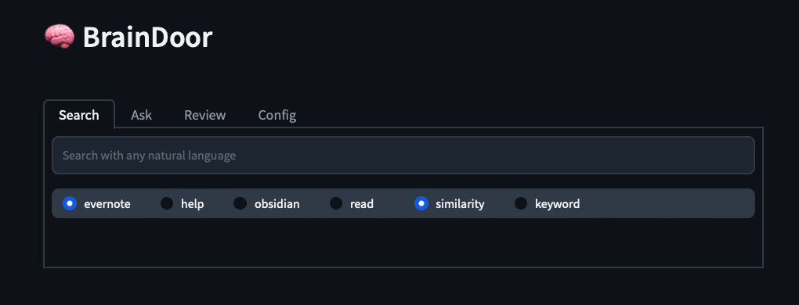
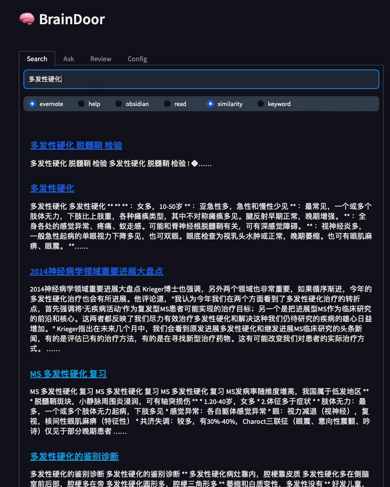
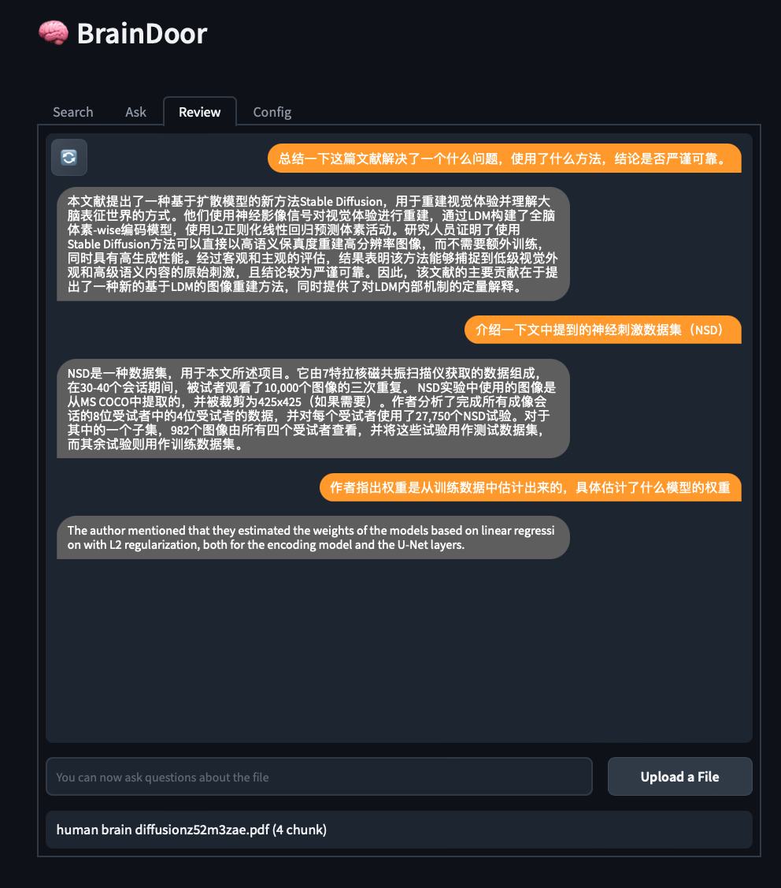

# 🧠 大脑门儿 BrainDoor

## 概述

大脑门儿可以方便的用本地文件来构建ChatGPT的外部知识库。支持自然语言搜索、问答和全文分析本地文档。



### 常见用例

- 用自然语言搜索个人文档或笔记
- 用本地文本资料构建一个特定领域的问答机器人
- 用chatgpt对长文本分析、问答

### 主要特点

- 灵活的构建本地的知识库：指定本地的一个或多个需要索引的文件夹路径，系统将检索和嵌入其中的文档构建一个向量型知识库。支持（txt，md，html，pdf，docx）
- 增量更新
- 提供一个Web UI，可通过浏览器远程访问。检索或问答引用的文档支持浏览器中直接打开。
- 长文档全文深度阅读

----
### 安装和启动
1、创建一个python3.9的conda虚拟环境
```shell
conda create -n braindoor python=3.9
```
2、安装依赖包
```shell
conda activate braindoor
pip install -r requirements.txt
```
3、启动
```shell
python app.py
```
<span style="color:red">浏览器中打开地址 127.0.0.1:7086，然后在Config标签中配置你的openai key才能正常使用！</span>    
国内用户可能还要在Config中配置http代理服务器地址，或则开全局代理    

---
### 创建知识库 Config / Create: new knowledge base
在大脑门儿中，一个向量仓库及它索引的文件夹中的文件，称为一个knowledge base。     
在Config --> Create a new knowledge base中，填写库名和一个本地文件夹路径，文件类型即可创建一个knowledge base。创建时只允许加入一个文件夹，但创建成功后可以在update中添加更多的文件夹。chunk size是将文件切片后嵌入的大小，如果你希望进行问答，切片大小1000-2000是合适的。超过2000容易突破gpt3.5-turbo的token限制。

> 例：假设我有一个obidian笔记仓库，路径为 `~/obsidian/myvult`。 
> 1. 先填写一个知识库名如: "mybase“
> 2. obsidian地址粘贴到 “Directory“中
> 3. 文件类型选择"md"和“txt“
> 4. 然后点击Create按钮
---

### 更新知识库 Config / Update existing knowledge base
- 当索引的文件夹内容有改动，点击update按钮检查同时更新向量仓库
- 改动知识库的一些配置后，需要点击"Save base config"按钮
- 可以为知识库增加更多的索引文件夹

> 例：我想把我的印象笔记也加入知识库中。先使用印象笔记的导出功能把所有笔记用单个html的形式导出到文件夹`~/evernote` 中。我可以在“Add a new directory to current knowledge base”文本框中，填写`~/evernote`，类型选择`html`。 然后点击 "Save base config"按钮。确认信息无误后，点击“Update"更新。

> 删除知识库: 在bases文件夹中直接删除对应的.base文件

---
### 搜索 Search
搜索模块主要用于检索你的知识库。选择一个知识库，使用任意自然语言搜索你的库，将会找到相似的文档。支持浏览器中直接打开文档。



> 相似性搜索虽然非常强大，但有时候也需要关键词的辅助。比如在一大段笔记中临时记录了一句话，而这段话和全文的主题无关。相似性搜索就很难根据这句话找到笔记，所以保留了关键词的选项。

---
### 问答 Ask

- 一个chatbot，将依据你的知识库中的内容作为证据来来回答你问题
- 默认情况下会参考库中最相似的文档片段（docoment chunk）
- 可以增加answer depth来让chatbot去参考更多相似文档
- 支持连续的问答，但不同的主题尽可能重新开启对话


>default表示不使用本地知识库，返回的是chatgpt的原始回答。

---
### 全文阅读 Review：
- 传入一份文档后即可针对该文档自由提问
- 和Ask不同的是，Review模块不会仅参考向量相似性匹配的文档片段，而是每个问题都会完整的阅读全文后给出答案
- 全文阅读不遗漏信息，速度较慢，但威力巨大
- 适用于详细的总结分析一份长文档，或辅助阅读文献
- 一次输入多个问题一般是节省资源的好办法
- 由于token限制，Review取消了联系上下文对话，仅对最近请求做出反应。所以每次提问都要清晰完整



> gpt是语言模型，即使使用Review模块提供完整的全文信息，从概率角度也不能保证回答一定正确。有时候同样的问题两次也会得出不同的答案，需要仔细的审查结果。可以反复的提问或适当的调整提问方式。

---
### 开销
需要准备openai的key。入库和Search使用text-ada-001模型。问答和阅读使用gpt3.5-turbo模型，这两个模型费用都很低。但要留意，如果你的知识库很庞大，注意入库的开销。另外，增加answer_depth和频繁的使用review功能也会根据本地文本的长度相应的增加开销。

---
### 配置
常用配置可以在config标签中设置
还有一些高级参数，不建议改动。如果需要可以在config.yaml文件中修改    

| 参数名                  | 类型    | 说明                                                                               | 默认值   |
| -------------------- | ----- | -------------------------------------------------------------------------------- | ----- |
| key                  | str   | 填写你的openai的key                                                                   | ‘‘    |
| rate_limit           | int   | 由于openai有请求速率限制，在创建向量仓库时候很容易被限制访问。1表示发送一个请求后休息1秒。只对创建和更新知识库时起作用。                 | 1     |
| proxy                | str   | 可在请求openai api时启用代理。填写你的代理地址，比如："http://127.0.0.1:1087"                           | ‘‘    |
| search_topk          | int   | 作用于Search模块。搜索返回的结果数。                                                            | 20    |
| result_size          | int   | 作用于Search模块。预览文字的长度。                                                             | 300   |
| answer_depth         | int:  | 作用于Ask模块，chabot在回答时，参考你的本地文档片段的最大数量。                                             | 1     |
| max_context          | int   | 作用于Ask模块。上下文最大token值。                                                            | 1000  |
| max_l2               | float | 作用于Ask模块。搜索相似本地片段时允许的最大L2距离。                                                     | 0.4   |
| HyDE                 | bool  | 作用于ASK模块。chatbot在参考本地文档前，根据你的问题预先用chatgpt生成一个初步回答，然后再匹配相似的本地文档。会增加准确性，但也会增加一点开销。 | false |
| review_chunk_size    | int   | 作用于Review模块，对传入的长文本切片时每块的最大token值。                                               | 2000  |
| review_chunk_overlap | int   | 作用于Review模块，对传入的长文本切片时重叠的token值。                                                 | 50    |

---
### 主要第三方依赖
- 大语言模型：chatgpt
- 文本拆分工具：langchain
- 向量仓库：faiss
- Web界面: gradio
