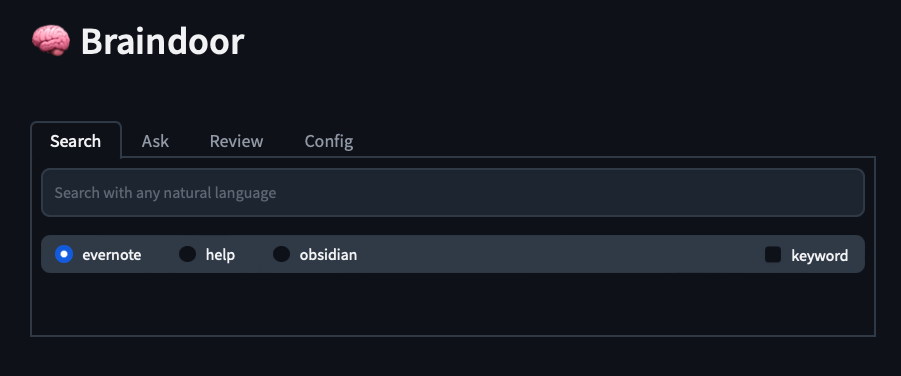
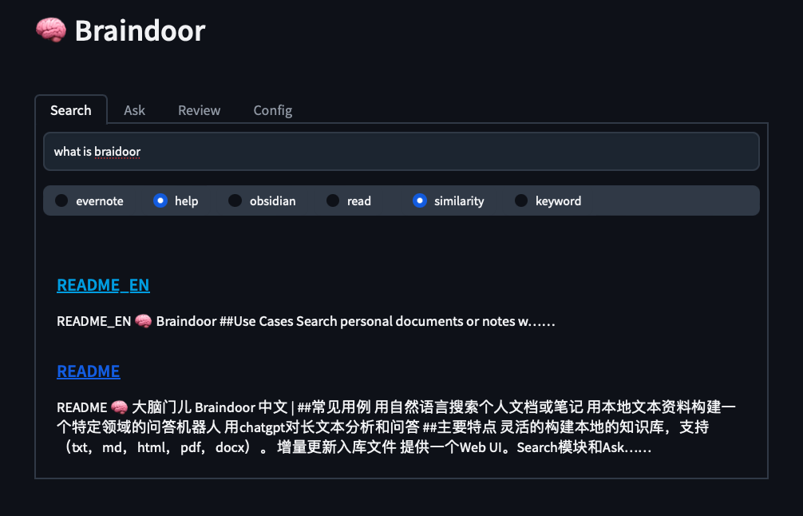
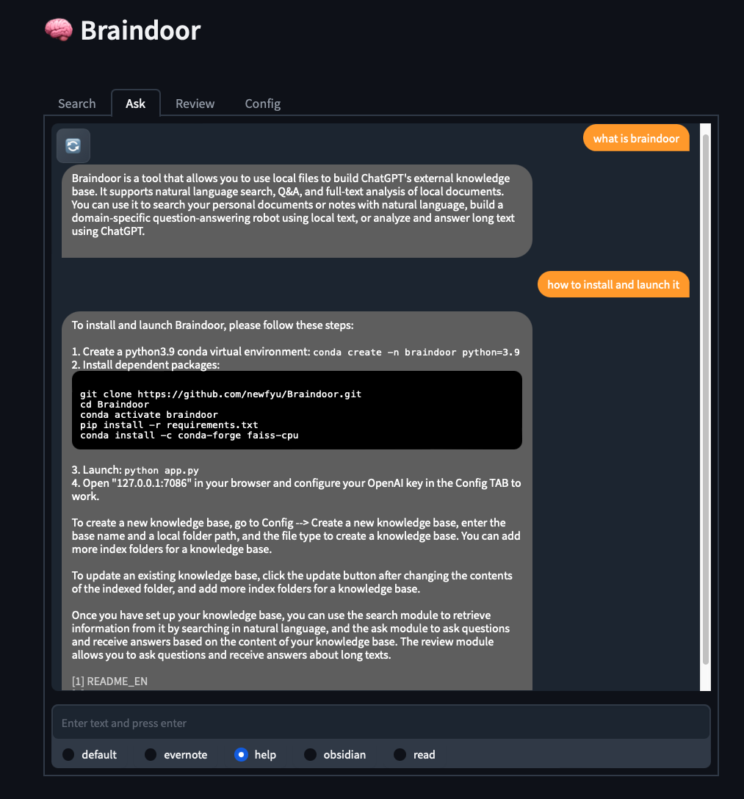
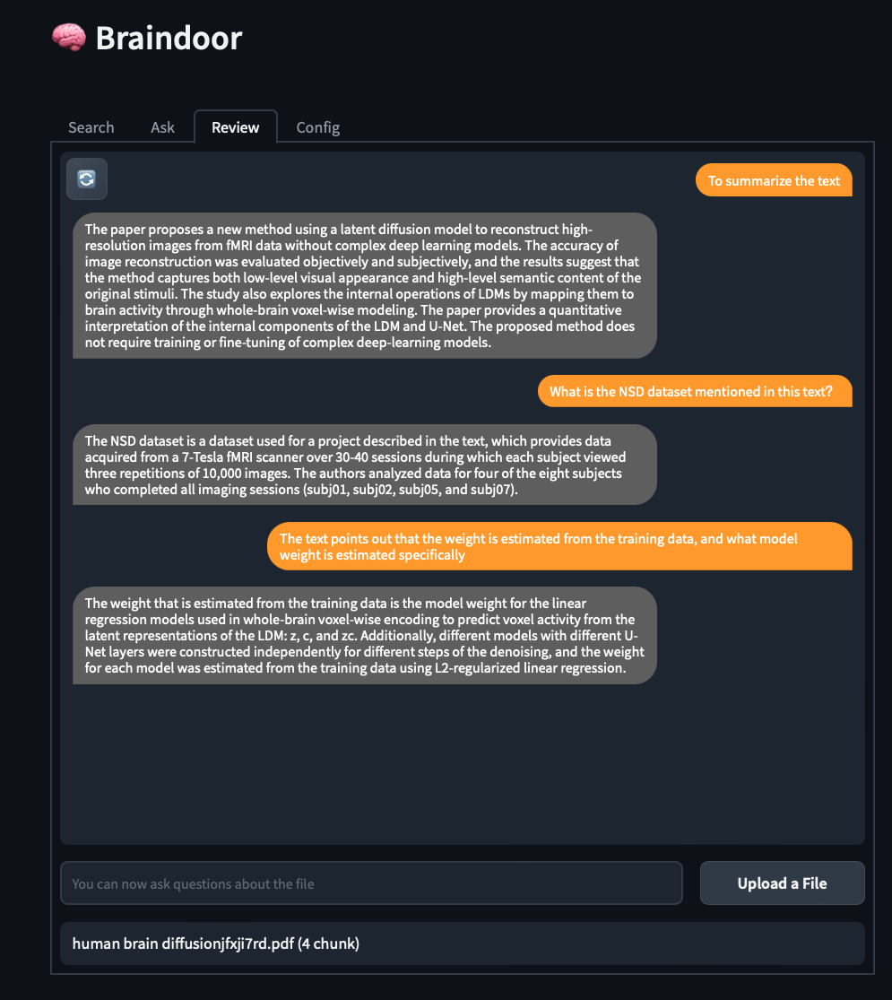

# 🧠  Braindoor

[中文](../README.md) | English

## Overview

Braindoor can easily use local files to build ChatGPT's external knowledge base. Support natural language search, Q&A and full text analysis of local documents.



### Use Cases

- Search personal documents or notes with natural language
- Build a domain-specific question answering robot using local text
- Use chatgpt to analyze and answer long text

### Features

- Flexible construction of local knowledge base (support txt, md, html, pdf, docx), only need to specify the local folder path
- Monitor the content change of the local index folder and update file incrementally
- Provide a web UI and tray shortcut switch, easy to use
- Support the context of any length document (principles)[#principle]

----

### Installation and launch

1、Create a python3.9 conda virtual environment

```shell
conda create -n braindoor python=3.9
conda activate braindoor
```

2、Install dependent packages

```shell
git clone https://github.com/newfyu/Braindoor.git
cd Braindoor
pip install -r requirements.txt
```

3、Launch

Windows, Liunx

```shell
python run.py
```

Open `127.0.0.1:7086` in browser and configure your `openai key` in the `Config` TAB to work!  

> Install in macos, macos M1, ubuntu, windows pass, if you have other installation questions, you can check [FAQ] (doc/FAQ.md), or leave a message.

>  The background run can be 'nohup python run.py &' then switched on and off via the tray icon

---

### Test connection

After filling in the key of openai. In the `Ask` module, select the `default` knowledge base to ask a question. If the result can be returned, the connection with chatgpt is normal.

> "Default" means that the local knowledge base is not used, and the original answer of chatgpt is returned.

---

### Create a new knowledge base

- In  braindoor, a vectorstore and its indexed folders are called a knowledge base  

- When the contents of the index folder are changed, `Load` the knowledge base created in `Config`  Tab `Update knowledge base`. Click the `Update` button again to check and update

- Only one index folder is allowed to be added during creation, but more folders can be added in update after creation is successful

- Chunk size is the max size of a document chunk. If you want to answer questions, the size of 1000-2000 is appropriate. Over 2000, it is easy to break the token limit of gpt3.5-turbo

> Example: Suppose I want to build a knowledge base with my obsidian notes.  My obsidian note location is `~/obsidian/myvult`. 
> 
> 1. First fill in a knowledge base name, such as: `mybase`
> 2. `~/obsidian/myvult`Paste into the `Directory` textbox
> 3. Select `md` and `txt` for file type
> 4. Then click the `Create` button

---

### Update existing knowledge base

- When the contents of the indexed folder have changed, click the `Update` button to check the changes and update the vectorstore.
- After changing some configurations of the knowledge base, you need to click the `Save base config` button
- You can add more index folders for a knowledge base

> Example:：I also want to add my Evernote to the knowledge base。
> 
> 1. First, use EverNote's export feature to export your notes in html format to any directory such as `~/evernote` 
> 
> 2. In the `Add a new directory to current knowledge base` text box, enter `~/evernote`, Type select `html`.
> 
> 3. Click the `Save base config` button. After confirming the information, click `Update` to update it. 

> Delete a knowledge base: directly delete the corresponding `.base` file in the bases folder

---

### Search

The search module is used to retrieve your knowledge base. Select a knowledge base and search in any natural language to find similar documents. It supports opening documents directly in the browser.



---

### Ask

- Ask module is a chatbot, which will use the content in your knowledge base as evidence to answer your questions

- By default, the most similar document chunk in the base is referenced

- You can increase the answer depth to allow chatbot to read more similar document chunks

- Support continuous Q & A, but reopen the dialogue on different topics as much as possible



---

### Review

- After passing in a document, you can freely ask questions about the full text of the document
- Unlike Ask, the Review chatbot will not only read the document chunk matched by vector similarity, but will read the full text for each question and give the answer
- Full text reading does not omit information, which is slow but powerful
- It is suitable for detailed summary and analysis of a long document or auxiliary reading of literature
- Due to token restrictions, Review canceled the contact context dialog and only responded to the latest request. So every question should be clear and complete



##### Principle

> GPT3.5 only supports 4000 tokens. To allow a user's question to fully browse any length of text before responding, a loop reading method is adopted in the review module. The principle is similar to a memory-based recurrent neural network. The long text is split into chunks of 2000 or less, and each segment is read sequentially with the question. The intermediate information obtained is then merged into the next chunk, until the full text has been read.

---

### Overhead

The openai key needs to be prepared. The text-ada-001 model is used for create vectorstores and Search. Ask module use the gpt-3.5-turbo model, both of which cost very little. But be aware, if you have a large knowledge base, be aware of the cost of create knowledge base. In addition, increasing answer_depth value and frequent use Review can add overhead depending on the length of the local text.

---

### Configuration

General configuration can be set in the config tab
There are some advanced parameters, which are not recommended to be changed. Modify it in the config.yaml file if necessary

| Parameter name                  | Type  | Description                                                                                                                                                                                                                                                                                  | Default |
| ------------------------------- | ----- | -------------------------------------------------------------------------------------------------------------------------------------------------------------------------------------------------------------------------------------------------------------------------------------------- | ------- |
| key                             | str   | Fill in your openai key                                                                                                                                                                                                                                                                      | ‘‘      |
| rate_limit                      | int   | Because openai has a request rate limit, it is easy to restrict access if there are a large number of requests in a short period of time when creating a vectorstore. 1 means a break of 1 second after sending a request. Takes effect only when the knowledge base is created and updated. | 1       |
| proxy                           | str   | The proxy can be enabled when the openai api is requested. Enter your http proxy address, for example: "http://127.0.0.1:1087"                                                                                                                                                               | ‘‘      |
| search_topk                     | int   | For the Search module. The number of results returned by the search.                                                                                                                                                                                                                         | 20      |
| result_size                     | int   | For the Search module. Preview the length of the text.                                                                                                                                                                                                                                       | 300     |
| answer_depth                    | int:  | For the Ask module. Chabot reads the maximum number of local document chunks when answering. The default of 1 means that only the most similar chunk will be read.                                                                                                                           | 1       |
| max_context                     | int   | For the Ask module. Maximum number of token for context.                                                                                                                                                                                                                                     | 1000    |
| max_l2                          | float | For the Ask module. Maximum L2 distance allowed when searching similar document chunk                                                                                                                                                                                                        | 0.4     |
| HyDE                            | bool  | For the Ask module. Chatbot uses chatgpt to generate a preliminary answer and then matches the similar local document chunk. It will increase accuracy, but it will also add a little overhead.                                                                                              | false   |
| review_chunk_size               | int   | For the Review module, the maximum token number of each block when splitting the long text.                                                                                                                                                                                                  | 2000    |
| review_chunk_overlap            | int   | The number of overlapping tokens when splitting long text.                                                                                                                                                                                                                                   | 50      |
| enable_search/ask/review/config | bool  | Enable each module,  false can hide the module.                                                                                                                                                                                                                                              | true    |

---

### Main third-party dependencies

- Language model: ChatGPT
- Text splitting: LangChain
- Vector stores: Faiss
- Web interface: Gradio
