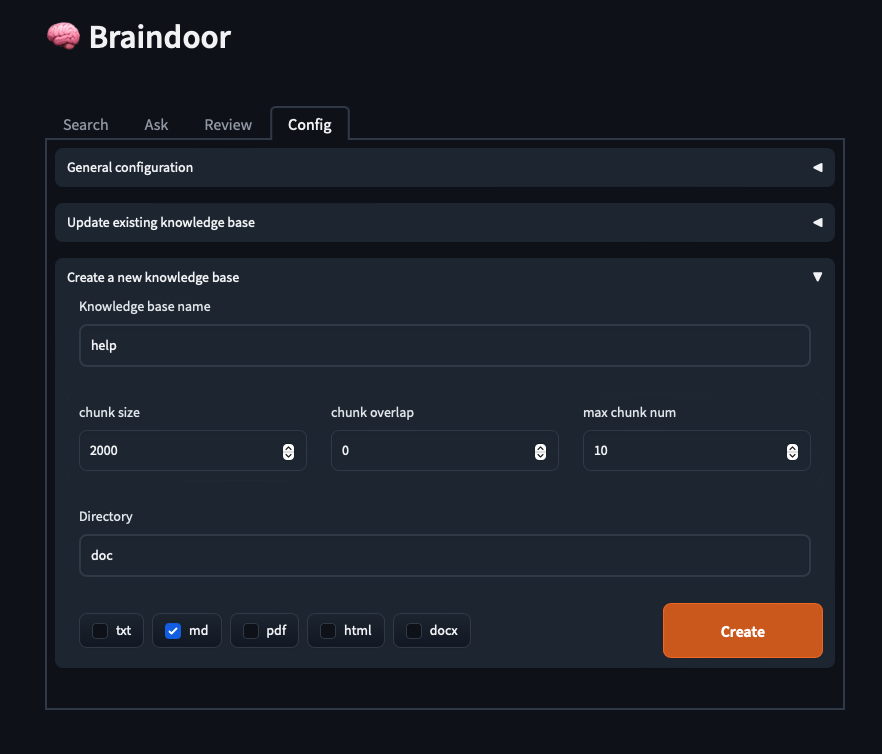
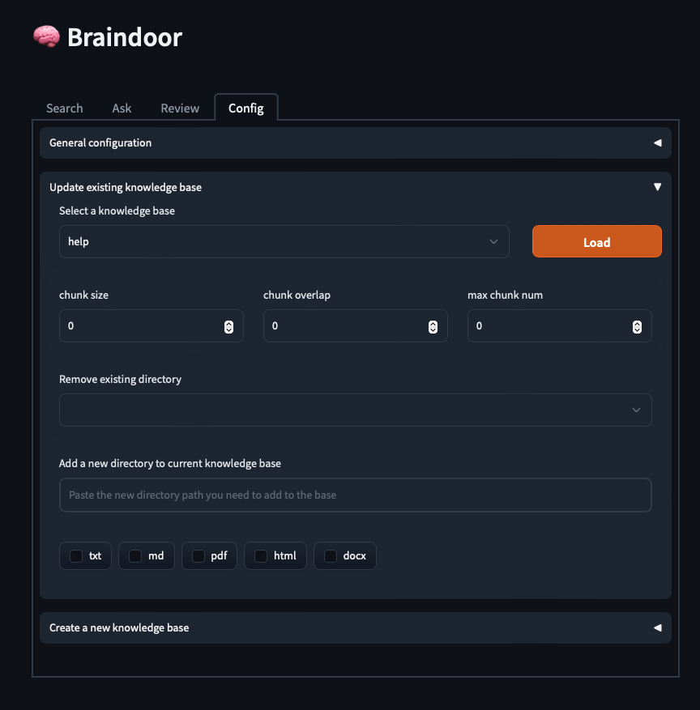

### 创建第一个本地知识库

以下步骤指导你创建第一个本地知识库。我们使用Braindoor目录下的doc文件夹作为一个示例，里面放的只有几个Braindoor的帮助文档，创建后可以直接通过Ask询问关于Braindoor的相关问题。

1. `Config`——>`Create a new knowledge base`
2. `Knowledge base name` 填写`help` （可以是任意的）
3. `chunk size` 一般填写1000-2000左右，表示文档片段的大小
4. `chunk  overlab` 一般填写0-100，表示片段重叠的大小
5. `max chunk num` 表示单个文档最大允许的片段数量，超过这个数量的片段忽略。针对一些特别长的文档，主要信息集中在前部，末尾有大量无意义信息，比如参考文献等。填写10可以至少提取前面20000左右的token
6. 文件目录填写`doc` (doc是相对路径,也可以填写绝对路径)
7. 文件类型选择`md`
8. 点击`Create`按钮，将开始对文档切割并向openai api发送嵌入请求。下方显示进度，该示例只有1-2个文档，预计1分钟内可以创建成功
9. 如果能创建成功，可验证你的各项设置均正常，可以再创建你自己的知识库了。

### 更新你的知识库

当doc文件夹中的`md`文件出现增加、改动、删除的时候，可以手动更新知识库

1. 点击`Config`  ——> `Update existing knowledge base`
2. 下拉菜单中选择`help`，点击`Load`按钮，会载入`help`知识库的各种设置
3. 下方会出现`Update`按钮，点击即可更新
4. 如果你想在`help`知识库中增加一个文件夹，也可以在下方的`Add a new directory`中填写。必须`Save config`，再点击`Update`按钮，会对新添加的文件夹进行扫描入库

